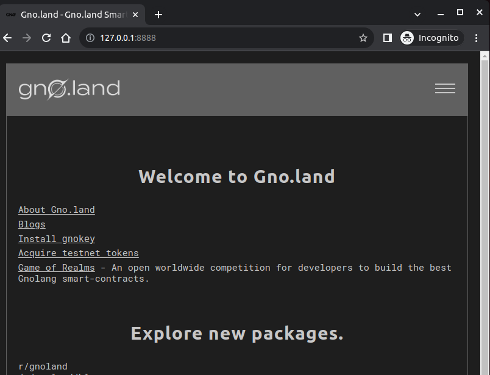

# How to get started with Web3 Programming using Gno

This is a short tutorial on how to get started with Web3 programming using Gnolang and Gnoland.

You only need some basic Go programming language knowledge. 

[Gnolang an interpreted variant of the Golang language](https://docs.onbloc.xyz/docs/terminology#gnolang) that [is built for Web3 programming](https://docs.onbloc.xyz/introduction-to-gnoland/what-is-gnoland/concepts#gnolang).

This means that you can directly transfer your Go skills to Web3 development.

## Source Code Editing Tools

For editing the code of this project I will be using [Visual Studio Code (VSCode)](https://code.visualstudio.com/).

The following two VSCode extensions are highly recommended:

- [Go in Visual Studio Code](https://code.visualstudio.com/docs/languages/go)

- [Gno for Visual Studio Code](https://marketplace.visualstudio.com/items?itemName=harry-hov.gno)

However, please feel free to use any other editing environment that you prefer.

## Introductory Gno

### Overview and Concepts

[What is Gnoland?](https://docs.onbloc.xyz/introduction-to-gnoland/what-is-gnoland)

Gnoland is a new smart contract platform based on Gnolang, a fork of Golang. Gnolang inherits the concurrency and developer-friendliness of Golang while fully leveraging the rich libraries and packages that are already available. This approach greatly accelerates application development by allowing dapp developers to reuse and re-assemble existing code, similar to how Cosmos simplified blockchain deployment. 

Gnoland introduces multiple concepts that together form a scalable, transparent, and sustainable blockchain ecosystem that suggest a viable solution to challenges that existing blockchains are faced with.

- [Overview](https://docs.onbloc.xyz/introduction-to-gnoland/what-is-gnoland/overview)

- [Concepts](https://docs.onbloc.xyz/introduction-to-gnoland/what-is-gnoland/concepts/)

- [Terminology](https://docs.onbloc.xyz/docs/terminology)

- [Proof of Contribution (PoC)](https://docs.onbloc.xyz/introduction-to-gnoland/what-is-gnoland/concepts#proof-of-contribution)

- [The Official Gnoland Blog](https://test3.gno.land/r/gnoland/blog)

- [Gnoland Developer Portal](https://docs.onbloc.xyz/)

- [Intro to Gnoland - The Smart Contract Platform to Improve Our Understanding of the World](https://test3.gno.land/r/gnoland/blog:p/intro)

- [Gnoland Virtual Machine (GnoVM)](https://docs.onbloc.xyz/docs/terminology#gnoland-virtual-machine-gnovm)

- [Tendermint2](https://docs.onbloc.xyz/docs/terminology#tendermint2)

### Packages

[Packages](https://docs.onbloc.xyz/docs/packages) encompass functionalities that are more closely aligned with the characteristics and capabilities of realms, as opposed to standard libraries.

- A unit that contains functionalities and utilities that can be used in realms.
- Gnolang [Packages](https://docs.onbloc.xyz/docs/building-a-realm/overview#packages) are stateless.
- The default import path is ```gno.land/p/~~~```.
- Can be imported to other realms or packages.

### Realms

A Gnolang [Realm](https://docs.onbloc.xyz/docs/building-a-realm/overview#realms) is where the state of an application lives.

- Realms are [Smart Contracts](https://docs.onbloc.xyz/docs/building-a-realm) in Gnolang.
- Realms are stateful.
- The default import path is ```gno.land/r/~~~```.
- Each realm has the capability to publicly export the function Render(path string) string, which performs rendering when passed a valid markdown as a parameter for the specified path.

## The Example Go Project that we will port to Gnolang

The example project for this tutorial is a simple number guessing game.

In the Go programming language, the essential logic for a command line guessing game program looks as follows:

```golang

// Set up the module:
// go mod init github.com/pietergreyling/web3_programming_with_gno/m/v2

package main

import (
	"bufio"
	"fmt"
	"math/rand"
	"os"
	"strconv"
	"strings"
	"time"
)

// Main holds the global state in this program - - - -
func main() {

	min, max := 1, 100
	tries := 0
	correct := false

	secret := rand.Intn(max-min) + min

	fmt.Println("-- Please guess a number between 1 and 100.")

	reader := bufio.NewReader(os.Stdin)

	for {
		tries++

		input, err := reader.ReadString('\n')
		if err != nil {
			fmt.Println("-- Error when reading input!", err)
			continue
		}

		input = strings.TrimSuffix(input, "\n")

		guess, err := strconv.Atoi(input)
		if err != nil {
			fmt.Println("-- Invalid input - that is not a number!")
			fmt.Println("-- Please enter a number.")
			continue
		}

		correct = TestGuess(guess, secret, min, max)
		if correct {
			break
		}
	}

	fmt.Println("-- You tried", tries, "times!")
}

// No global state is held here - - - -
func TestGuess(guess int, secret int, min int, max int) bool {

	correct := false

	fmt.Println("-- Your guess is: ", guess)

	if guess > secret {
		correct = false
		fmt.Println("-- That is higher than the secret number.")
		fmt.Println("-- Please try again...")
	} else if guess < secret {
		correct = false
		fmt.Println("-- That is lower than the secret number.")
		fmt.Println("-- Please try again...")
	} else {
		correct = true
		fmt.Println("-- That is the correct number, congratulations!")
	}

	return correct
}

```

Please notice that we have made sure to separate the stateful main function from the stateless number guessing code. This is in order to be in line with the Gnolang concepts of Realms and Packages:

- The stateful main function will become a Realm
- The stateless number guessing code will become a Package

As preparation for porting this to a Gnolang realm and package architecture we run a quick test by executing the following:

```shell
cd src_go
go run .
-- Please guess a number between 1 and 100.
50
-- Your guess is:  50
-- That is lower than the secret number.
-- Please try again...
75
-- Your guess is:  75
-- That is higher than the secret number.
-- Please try again...
62
-- Your guess is:  62
-- That is lower than the secret number.
-- Please try again...
68
-- Your guess is:  68
-- That is higher than the secret number.
-- Please try again...
65
-- Your guess is:  65
-- That is lower than the secret number.
-- Please try again...
67
-- Your guess is:  67
-- That is the correct number, congratulations!
-- You tried 6 times!
```

We have now verified that the program is working as expected.

## Setting up the Gno Development Environment

### Prerequisites

#### Important Notes before proceeding

- To install Gno I used:

  ```shell
  # git clone https://github.com/gnolang/gno.git
  git submodule add https://github.com/gnolang/gno.git
  ```

  Instead of (as per the documentation):

  ```shell
  git clone git@github.com:gnolang/gno.git
  ```

#### Now Install the following

The dependencies below are required to develop applications for the Gno platform.


- Install the latest version of [Go](https://go.dev/) if you haven't already.

  On my system:

  ```shell
  go version
  >> go version go1.21.1 linux/amd64
  ```

- Install [gofumpt](https://github.com/mvdan/gofumpt).

  ```shell
  go install mvdan.cc/gofumpt@latest
  ```

- Install [Gno](https://github.com/gnolang/gno/tree/master/gnovm/cmd/gno#install).
  
  I will use this method:

  ```shell
  cd [YOUR_PROJECT_ROOT_DIRECTORY]
  # git clone https://github.com/gnolang/gno.git
  git submodule add https://github.com/gnolang/gno.git
  cd ./gno
  make install_gno
  ```

  But one can also install gno like this:

  ```shell
  go install github.com/gnolang/gno/gnovm/cmd/gno
  ```
  
- Install [Gnokey](https://github.com/gnolang/gno/tree/master/gno.land/cmd/gnokey#install-gnokey).

  ```shell
  cd ./gno
  make install_gnokey
  ```

- Install [Gnoland](https://github.com/gnolang/gno/tree/master/gno.land/cmd/gnoland).

  ```shell
  cd ./gno/gno.land
  make install.gnoland
  ```

- Install [Gnoweb](https://github.com/gnolang/gno/tree/master/gno.land/cmd/gnoweb) (install and run a local gnoland instance first).

  ```shell
  cd ./gno/gno.land
  make install.gnoweb
  ```

For verification, our installation output should look similar to the following:

  ```shell
  go install mvdan.cc/gofumpt@latest
  >> go: downloading mvdan.cc/gofumpt v0.5.0
  >> go: downloading golang.org/x/sync v0.1.0
  >> go: downloading golang.org/x/mod v0.10.0
  >> go: downloading golang.org/x/tools v0.8.0

  make install_gno
  >> make --no-print-directory -C ./gnovm    install
  >> go install ./cmd/gno
  >> [+] 'gno' is installed. more info in ./gnovm/.

  make install_gnokey
  >> make --no-print-directory -C ./gno.land install.gnokey
  >> go install ./cmd/gnokey
  >> [+] 'gnokey' is installed. more info in ./gno.land/.

  make install.gnoland
  >> go install ./cmd/gnoland

  make install.gnoweb
  >> go install ./cmd/gnoweb
  >> go: downloading github.com/gorilla/mux v1.8.0
  >> go: downloading github.com/gotuna/gotuna v0.6.0
  >> go: downloading github.com/gorilla/sessions v1.2.1
  >> go: downloading github.com/gorilla/securecookie v1.1.1
  ```

We can now ask for help from the Gno tools:

```shell
gno help 

gnokey help

gnoland help
```

#### Testing the Local Development Platform Setup

Starting Gnoland:

```shell
cd ./gno/gno.land
gnoland start
>> .level 1 .msg Starting multiAppConn [impl multiAppConn [module proxy]]
>> .level 1 .msg Starting localClient [[impl localClient [module abci-client connection query]] [module proxy]]
.....
```

Starting Gnoweb:

```shell
gnoweb
>> Running on http://127.0.0.1:8888
```

Navigating to Gnoweb at http://127.0.0.1:8888 with a browser should present the following:



----

## Building the GnoGuess Application

### Where to place our Code

Currently, in order to create our Gnolang package and realm ```.gno``` code files, we have to be aware of the following folders:

```shell
# the root
gno/examples/gno.land

# the folder for packages
gno/examples/gno.land/p/demo
 
# the folder for realms
gno/examples/gno.land/r/demo

# the folder tree
├── gno
│   ├── examples
│   │   └── gno.land
│   │       ├── p
│   │       │   └── demo
│   │       │       ├── ...
│   │       │    
│   │       └── r
│   │           ├── demo
│   │           │   ├── ...
 ```

## References

- [Gnoland on YouTube](https://www.youtube.com/@_gnoland)

  - [Jae Kwon: Gnoland the Inevitable Next Generation Smart Contract Platform](https://youtu.be/IJ0xel8lr4c?list=PLc_cC_y0BSHymUiUnIoZPeg_BpYwitw8V)

  - [GNO Example Demo](https://youtu.be/-BlnEXCs0eI)

  - [Quick Intro to Gno](https://youtu.be/bA-lMd60Lts?list=PLc_cC_y0BSHymUiUnIoZPeg_BpYwitw8V)

  - [Go to Gno: How to build a microblog](https://youtu.be/F-_dadxcRJM?list=PLc_cC_y0BSHymUiUnIoZPeg_BpYwitw8V)

- [Gnolang on GitHub](https://github.com/gnolang/gno)

  - [Gno(Lang) & Gno.land](https://github.com/gnolang)

  - [Quickstart Guide](https://github.com/gnolang/gno/blob/master/examples/gno.land/r/demo/boards/README.md)

  - [Gnoland Developer Portal](https://docs.onbloc.xyz)

  - [Awesome Gno](https://github.com/gnolang/awesome-gno)

  - [Awesome Gno Tutorials](https://github.com/gnolang/awesome-gno#tutorials)

  - [Gnolang Examples](https://github.com/gnolang/gno/tree/master/examples)

- [Gno By Example](https://gno-by-example.com)

- [Gnoland's Blog](https://test3.gno.land/r/gnoland/blog)
